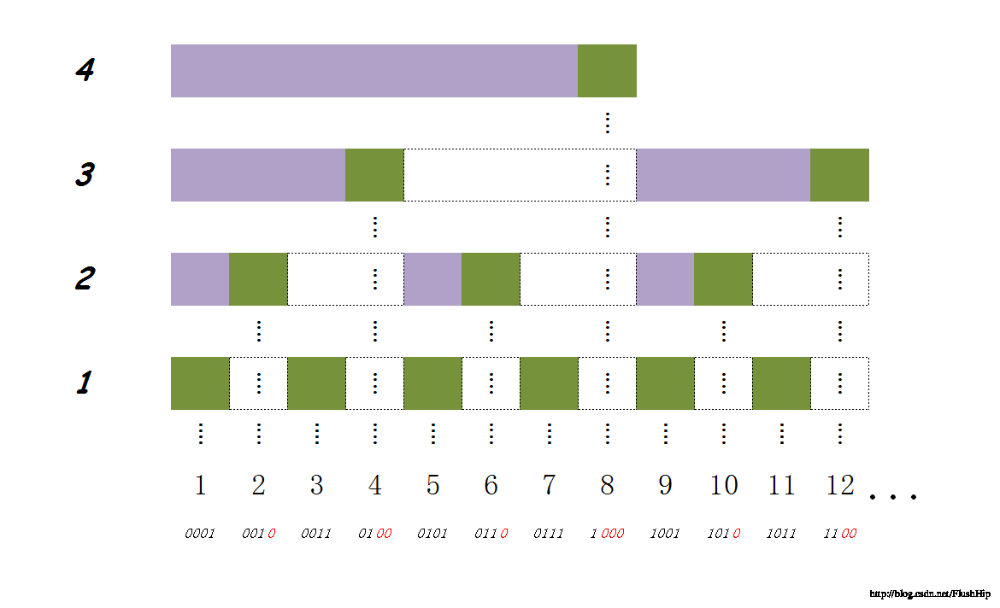

# 树状数组

## 理解

每一个二进制数可以展开成二的幂次表示。例如1011 = 1 + 10 + 1000= 1+2+8= 11 = 8个+2个+1个 = C[8] + C[8+2] + C[8+2+1] = C[8]+C[10]+C[11]

* 上面这个图，横轴表示数组的元素下标

* 每一个方块表示原来数组arr的元素。每个方块下方的序号表示arr中该元素的下标。

* 每一个长条表示树状数组C的元素。每个长条右边绿色那个方块下方的序号表示C中该元素的下标。

## 要点

### 区间查询

* 可见，对于任何一个前缀和Sum[k]，可以把k按2的幂次分解成$n_1+n_2+..n_m$。（由大到小）

$$
Sum[k] = C[n_1] + C[n_1+n_2] + ... + C[n_1+n_2+...+n_m]
$$

* 也就是
  $$
  a_m = k, a_{i-1} = a_i-lowbit(a_i), 直到a_i = 0
  $$

### 单点更新

* 任何一个arr[i] 直接对应C[i]
* 然而C[i]元素还会作为C[i+lowbit(i)]的一部分
  * C[i+lowbit(i)] = a[i+lowbit(i) - lowbit(i+lowbit(i))+1] + a[i+lowbit(i) - lowbit(i+lowbit(i))+2] + ... + a[i+lowbit(i)] + 
* 所以arr[i]还会影响C[n1],C[n2]...
  * $n_m = n_{m-1}+lowbit(n_m-1)$
  * $n_1 = k$，直到$n_m$超出界限

### 解题

- 根据原来的数组Array（或者没有原来的数组也可以）构造C
- 判断区间特性（例如最大值）与子区间特性的关系（例如S_{n:m} = S_{1:m}-S_{1:(n-1)}，S代表求和）
- 更新C和查询区间特性

